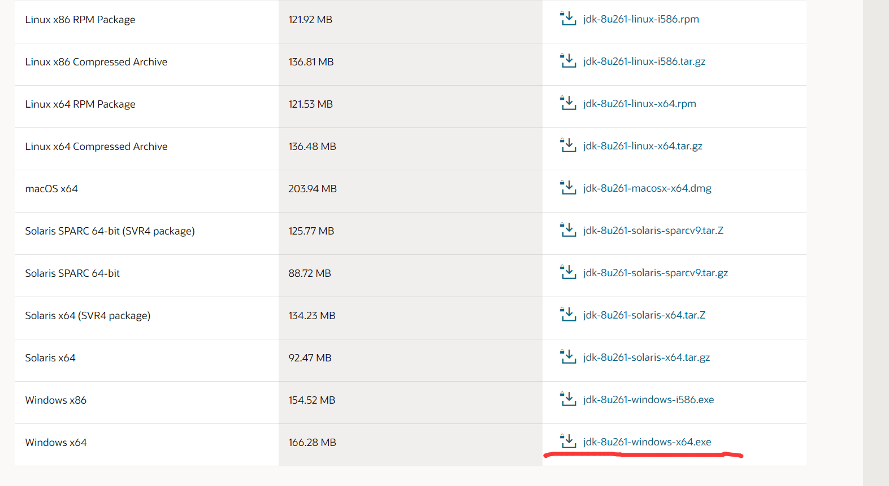
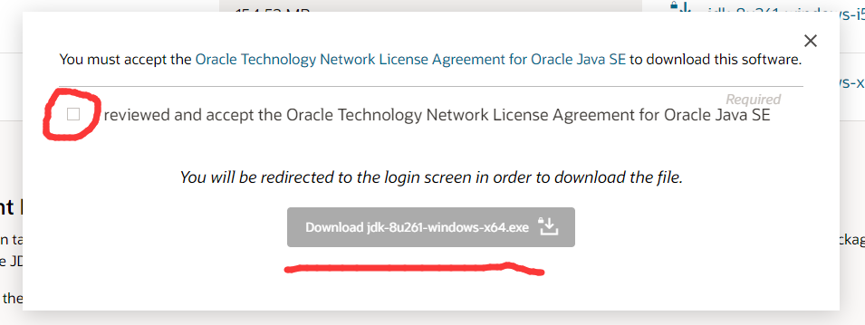
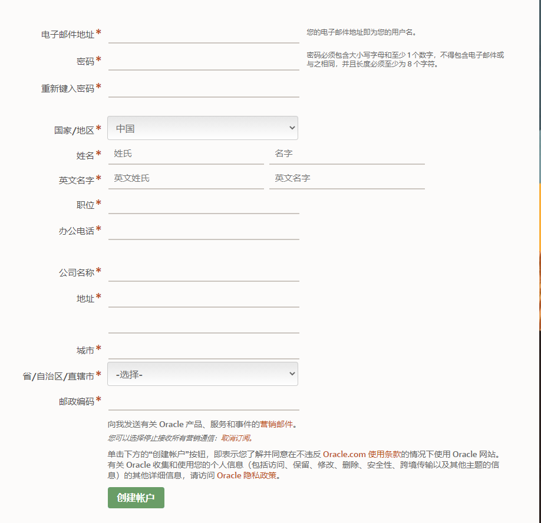
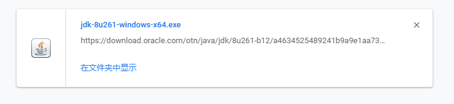

# 下载及安装JDK
[JDK下载地址](https://www.oracle.com/java/technologies/javase/javase-jdk8-downloads.html)
先点进官网

画圈的地方打上勾,然后Download.....

然后有账号直接登录，没有账号直接注册,如果注册的话，后面不会写的乱填即可,创建完后，去邮箱里完成验证，注册成功

登录之后会自动下载，然后就是漫长的等待...
 
JDK的安装非常简单，跟安装QQ都是一样的，下一步就行了
