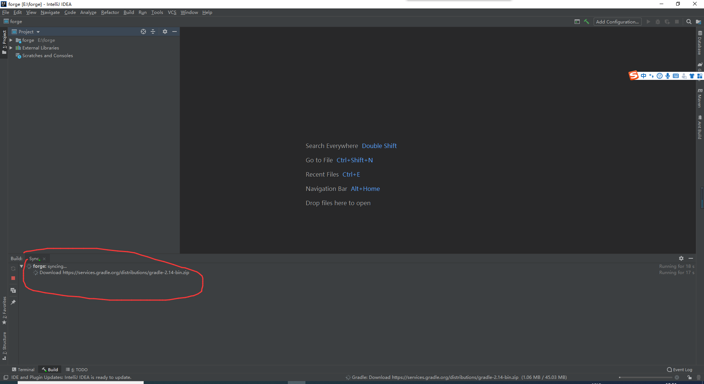
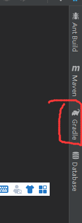
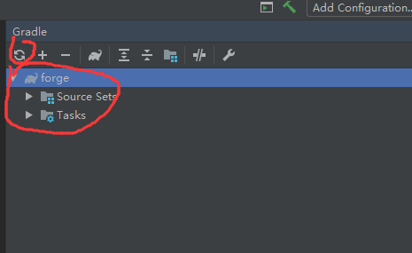
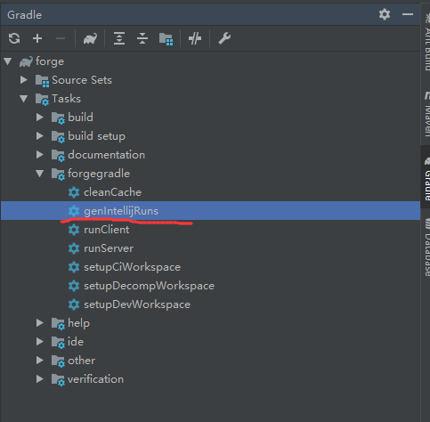
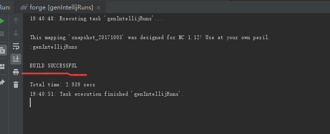
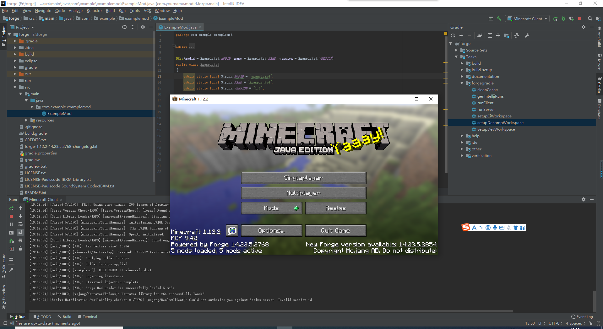

# 下载及配置forge开发环境
[forge官网](https://files.minecraftforge.net/)点进官网 
点击左边的1.12.2，下面就是所有1.12.2的所有forge版本，教程以forge1.12.2-2768为例 
 
找到14.23.5.2768，点击MDK，然后会转到一个forge的广告网站，点击skip，就会自动下载forge 
 
 
如果你点进去加载不出来skip，可以参考[这篇教程](https://jingyan.baidu.com/article/b2c186c8d5ed79c46ef6ffbc.html)，不过还是建议点下forge的广告，这样forge才能有收入维护项目 
forge解压出来大致如下 
 
打开idea，选择import project，选择forge的解压目录，OK 
 
选择import project from external model->gradle 
 
然后next->finish，等待IDEA配置forge 
 
如果一直失败，关闭idea，[戳我加群:926691428](https://jq.qq.com/?_wv=1027&k=B1PuXsmy)下载配置好的gradle放在"C:\Users\用户名"下，然后重启idea,点击右侧的gradle 
 
点开后如果gradle能够向下展开，source sets和tasks，就说明配置成功，如果没有点击左上角的按钮直到gradle能展开source sets和tasks 
 
向下展开Tasks->forgegradle，点击IntelljRuns生成运行按钮 
 
直至出现BUILD SUCCESSFUL说明配置成功，不行就多跑几遍 
 
配置完后点击运行按钮，弹出以下窗口，点击Use classpath of module的下拉菜单，选择第四个com.yourname.modid.forge.main，然后Run,完美报错java.io.FileNotFoundException,回到gradle，下拉Tasks->forgegradle，点击setupDecompWorkspace，重新运行，是不是MC就出来了？ 
