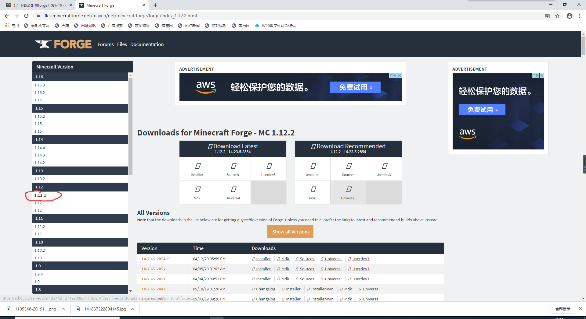
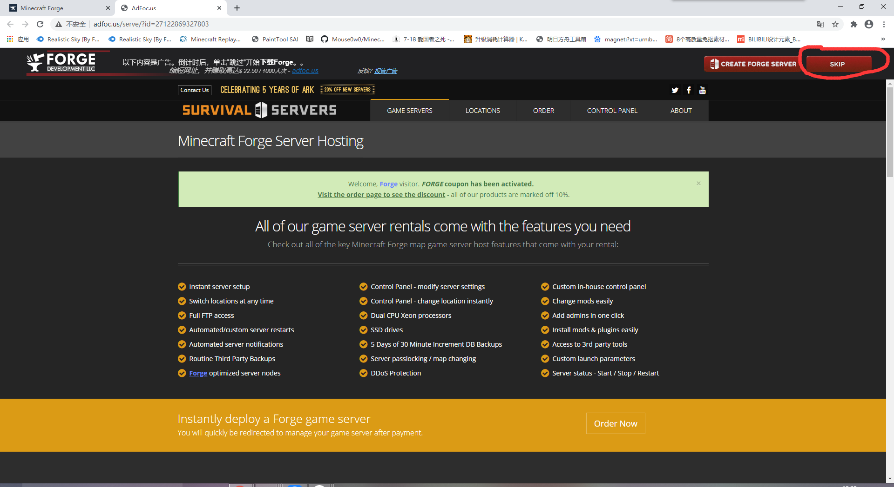
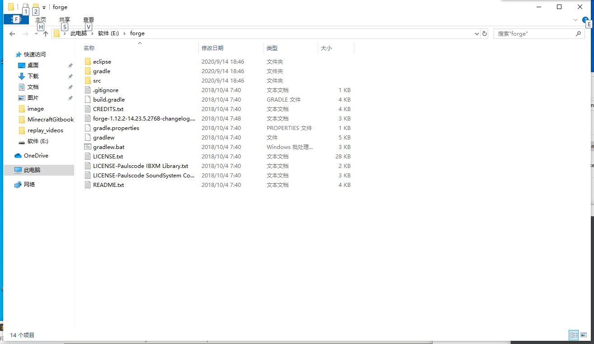
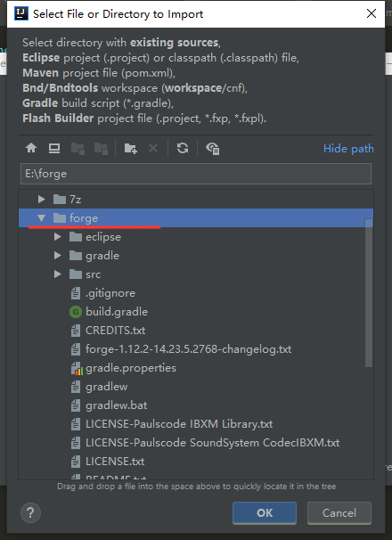
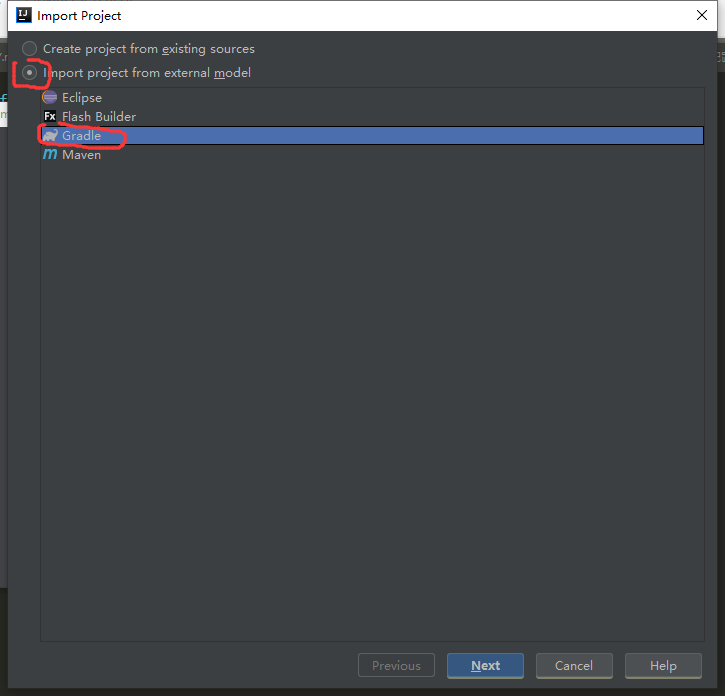

# 下载及配置forge开发环境
[forge官网](https://files.minecraftforge.net/)点进官网 
点击左边的1.12.2，下面就是所有1.12.2的所有forge版本，教程以forge1.12.2-2768为例 
 
找到14.23.5.2768，点击MDK，然后会转到一个forge的广告网站，点击skip，就会自动下载forge 
 
 
如果你点进去加载不出来skip，可以参考[这篇教程](https://jingyan.baidu.com/article/b2c186c8d5ed79c46ef6ffbc.html)，不过还是建议点下forge的广告，这样forge才能有收入维护项目 
forge解压出来大致如下 
 
打开idea，选择import project，选择forge的解压目录，OK 
 
选择import project from external model->gradle 
 
然后next->finish，等待IDEA下载gradle 
 