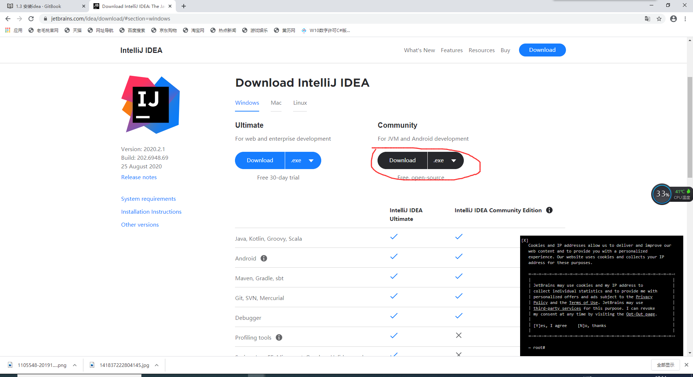
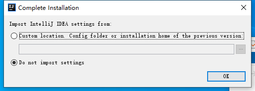
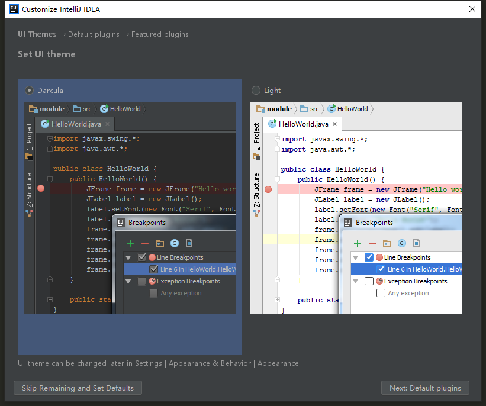
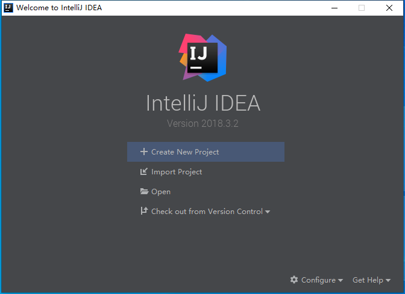

# 安装idea
[idea下载地址](https://www.jetbrains.com/idea/download/#section=windows) 
左边是收费的，右边是社区版本，社区版本完全足够模组开发了，所以推荐选择社区版本 

如果使用新版本的idea开发模组，可能会出现材质包加载错误的情况，换低版本的idea即可...不要问为什么，问就是过来人。什么？你说你找不到老版本的idea？[戳我加群:926691428](https://jq.qq.com/?_wv=1027&k=B1PuXsmy),老版本的idea跟新版本的idea安装基本一致，教程以IntelliJ IDEA 2018.3.2为例 
OK 
 
看你喜欢哪个风格，选择next 
 
后面一直next即可，出现以下即安装完毕 
