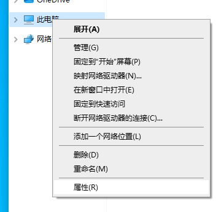
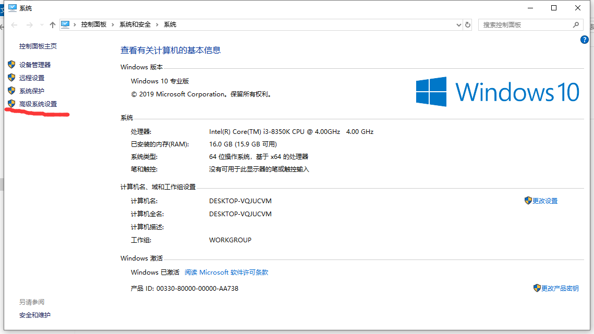
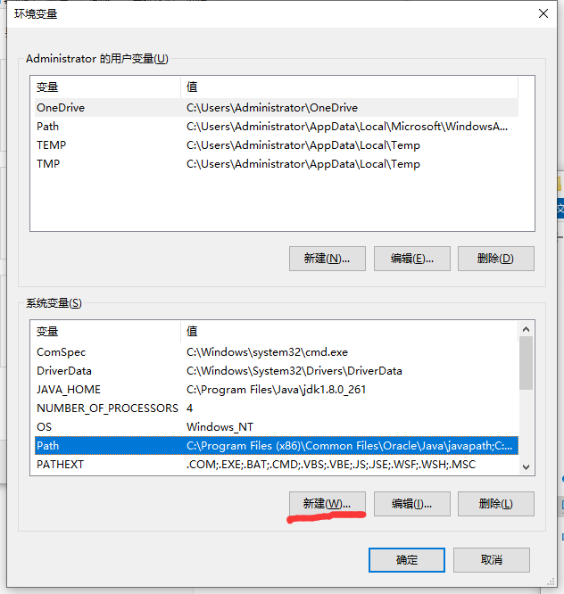
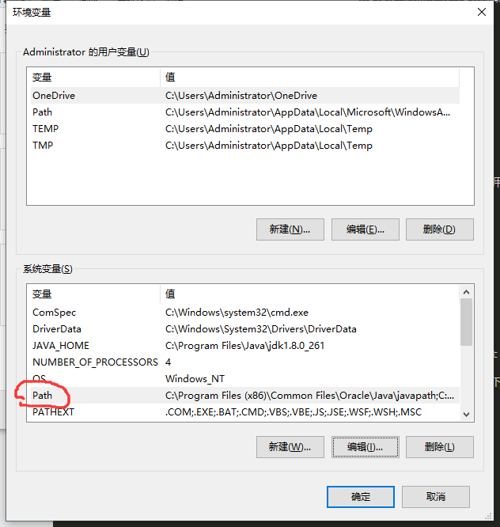
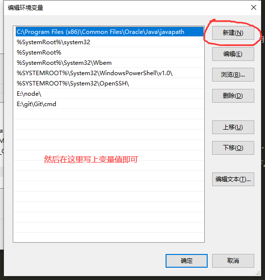
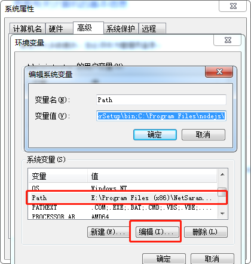
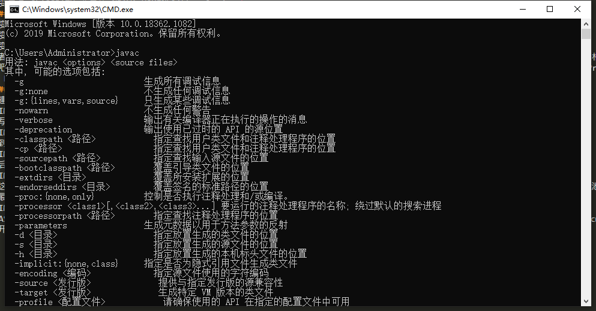

# 配置JDK开发环境
对着计算机右键->属性 
 
高级系统设置 
 
环境变量 
 
环境变量分为用户变量和系统变量，如果在用户变量上设置，这个环境只作用于当前系统用户，如果写在系统变量，这个环境将作用于你的计算机上的所有用户，根据自己需求选择即可，教程将写在系统变量 
####需要写的的参数如下: 
1.变量名:JAVA_HOME 变量值:JDK路径 
2.变量名:Path 变量值:%JAVA_HOME%\bin 
3.变量名:Path 变量值:%JAVA_HOME%\jre\bin 
4.变量名:CLASSPATH 变量值:. 
5.变量名:CLASSPATH 变量值:%JAVA_HOME%\lib 
6.变量名:CLASSPATH 变量值:%JAVA_HOME%\lib\dt.jar 
7.变量名:CLASSPATH 变量值:%JAVA_HOME%\lib\tools.jar 
####简化参数
1.变量名:JAVA_HOME 变量值:JDK路径 
2.变量名:Path 变量值:%JAVA_HOME%\bin;%JAVA_HOME%\jre\bin 
3.变量名:CLASSPATH 变量值:.;%JAVA_HOME%\lib;%JAVA_HOME%\lib\dt.jar;%JAVA_HOME%\lib\tools.jar 
前者跟后者没有任何区别，变量值是由分号分隔的，第一个参数与第二个参数中间有一个分号，根据这个思路，你应该能够看出，前者跟后者的变量值是相同的吧，配置方式上，win7跟win10也有一定的区别，本教程会在下方列出win10和win7的配置方法。JDK的路径，如果你是默认安装，一般JDK路径在C:\Program Files\Java下，或者C:\Program Files(X86)\Java下，或者你是指定路径安装的JDK的话，那么就写你安装的路径 
####添加变量
新建 
 
填写完变量名和变量值后点击确定
 
找到Path，双击打开它，找不到就新建
 
然后新建，把上面需要写的变量值填写进去，也可以填简化参数，两者没有任何区别 
 
在这里win7可能是这个样子的，不用慌，本质上还是跟win10差不多的，我们只需要把光标划到变量值的最后，用一个分号来分隔开变量值，再把变量值添加到最后，以此类推 
 
CLASSPATH跟配置Path同理，唯一不同的就是CLASSPATH可能会不存在，创建一个就行了，这里就不再多阐述了，配置完毕后，win+r打开命令行，输入cmd打开黑窗口,输入Javac回车，如果出现以下情况，那么恭喜你，JDK环境配置成功！ 
